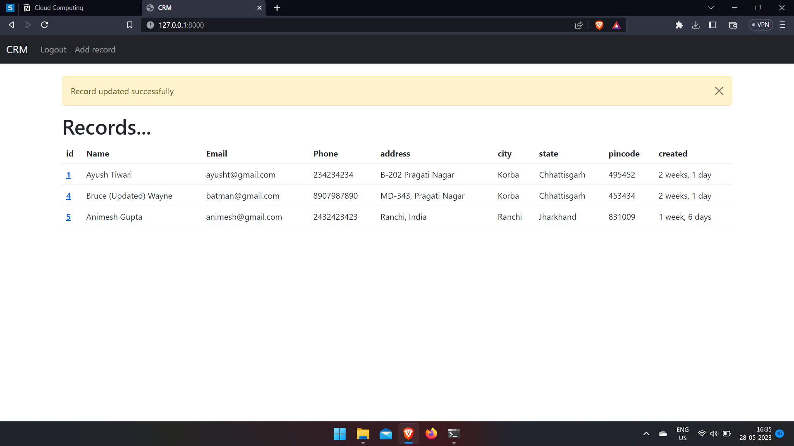
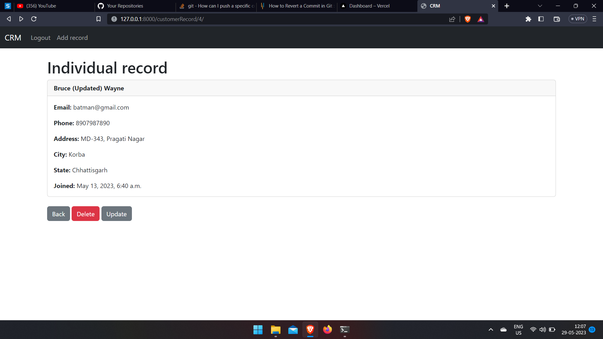
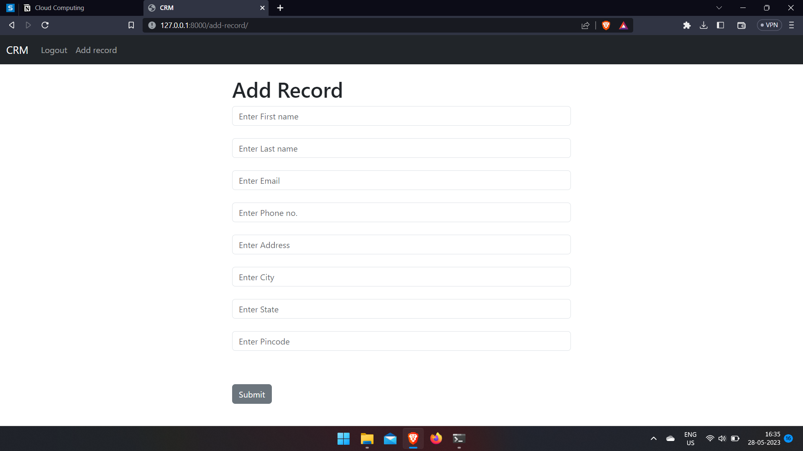

# Basic CRM
 
 *Live link - https://web-production-1c9f.up.railway.app/*
 
**Run command in shell/teminal**
> python manage.py runserver

* A django web app with **CRUD** functionality.

## Home Page

## Details Page

## Add Record

